<!-- hero: monochrome ASCII portrait (types in) beside the extruded 3d ascii
     wordmark (wipes in left-to-right, then rocks on its vertical axis).
     widths are picked so both panels land at the same height. -->

<h3><code>Harish-tig@github ~ $ whoami</code></h3>

<table>
<tr>
<td valign="top"></td>
<td valign="top"></td>
</tr>
</table>

 
 

<!-- animated contribution graph: real data, boxes reveal cell by cell -->

<h3><code>Harish-tig@github ~ $ ./contributions.sh</code></h3>

 
 

<h3><code>Harish-tig@github ~ $ ./links.sh</code></h3>

<b>Harish Nadar · Software Developer | AIML</b>

 

