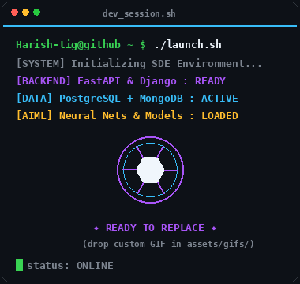

<div align="center">

<!-- ═══════════════════════════════════════════════════════════════════
     HEADER  ·  animated typing intro  ·  generated: assets/svg/typing-header.svg
     To regenerate: python scripts/generate_typing_header.py
     ═══════════════════════════════════════════════════════════════════ -->


<br>

<!-- ── Navigation ─────────────────────────────────────────────────── -->
<sub>
&nbsp;
<code><a href="#info-sh">$ info.sh</a></code>
&nbsp;·&nbsp;
<code><a href="#profile-sh">$ profile.sh</a></code>
&nbsp;·&nbsp;
<code><a href="#contributions-sh">$ contributions.sh</a></code>
&nbsp;·&nbsp;
<code><a href="#stack-sh">$ stack.sh</a></code>
&nbsp;·&nbsp;
<code><a href="#social-sh">$ social.sh</a></code>
&nbsp;
</sub>

</div>

<br>

<!-- ════════════════════════════════════════════════════════════════════
     INFO  ·  two-column layout: GIF left, JSON info card right
     ════════════════════════════════════════════════════════════════════ -->
<h3 id="info-sh"><code>harish@github:~ $ ./info.sh</code></h3>

<table>
<tr>
<td width="45%" valign="top" align="center">

<!-- ── Profile GIF ──────────────────────────────────────────────────
     Replace: drop your own GIF at  assets/gifs/profile.gif
     No other file needs changing.
     ──────────────────────────────────────────────────────────────── -->


</td>
<td width="55%" valign="top">

<!-- ── JSON info card ───────────────────────────────────────────────
     Generated: python scripts/generate_info_card.py -> assets/svg/info-card.svg
     ──────────────────────────────────────────────────────────────── -->


</td>
</tr>
</table>

<br>

<!-- ════════════════════════════════════════════════════════════════════
     PROFILE  ·  developer overview
     ════════════════════════════════════════════════════════════════════ -->
<h3 id="profile-sh"><code>harish@github:~ $ ./profile.sh</code></h3>

```
$ whoami

  Software engineer leaning into backend systems — REST APIs, data models,
  infrastructure. Currently completing a B.E. in Artificial Intelligence &
  Machine Learning at the University of Mumbai (Class of 2026).

  Stack of choice: Python + FastAPI / Django + PostgreSQL.
  Learning the parts of the stack that don't show up in tutorials.

  Competed in national hackathons, placed 1st in algorithm development,
  reached the Smart India Hackathon finals in 2024.

  Outside the terminal: football.
```

<br>

<!-- ════════════════════════════════════════════════════════════════════
     CONTRIBUTIONS  ·  purple snake on GitHub contribution heatmap
     Generated daily by GitHub Actions (see .github/workflows/)
     ════════════════════════════════════════════════════════════════════ -->
<h3 id="contributions-sh"><code>harish@github:~ $ ./contributions.sh</code></h3>

<div align="center">

</div>

<br>

<!-- ════════════════════════════════════════════════════════════════════
     STACK  ·  verified technologies only
     ════════════════════════════════════════════════════════════════════ -->
<h3 id="stack-sh"><code>harish@github:~ $ ./stack.sh</code></h3>

```json
{
  "languages":   ["Python", "JavaScript", "SQL", "C"],
  "backend":     ["FastAPI", "Django", "Django REST Framework", "Flask", "JWT Auth"],
  "databases":   ["PostgreSQL", "MongoDB", "MySQL", "Redis"],
  "ai_ml":       ["TensorFlow", "Keras", "Scikit-Learn", "CNN", "LSTM", "Transfer Learning"],
  "data":        ["NumPy", "Pandas", "Matplotlib"],
  "cloud_devops":["AWS (EC2, S3, Lambda, Elastic Beanstalk)", "Docker", "Linux", "Git"],
  "tools":       ["Postman", "Cloudinary", "Vercel", "Render"]
}
```

<div align="center">

[](https://www.python.org/)
[](https://fastapi.tiangolo.com/)
[](https://www.djangoproject.com/)
[](https://www.postgresql.org/)
[](https://www.mongodb.com/)
[](https://redis.io/)
[](https://aws.amazon.com/)
[](https://www.docker.com/)
[](https://www.tensorflow.org/)
[](https://www.kernel.org/)

</div>

<br>

<!-- ════════════════════════════════════════════════════════════════════
     SOCIAL  ·  verified links only
     ════════════════════════════════════════════════════════════════════ -->
<h3 id="social-sh"><code>harish@github:~ $ ./social.sh</code></h3>

```
$ ./social.sh --ping

  GitHub     ->  github.com/Harish-tig
  LinkedIn   ->  linkedin.com/in/harish-nadar-tig
  Portfolio  ->  harishnadar.tech
  Instagram  ->  instagram.com/harish_05n
  LeetCode   ->  leetcode.com/u/harish_tig
  Email      ->  nadarharish03@gmail.com
```

<div align="center">

[GitHub](https://github.com/Harish-tig) &nbsp;·&nbsp;
[LinkedIn](https://www.linkedin.com/in/harish-nadar-tig/) &nbsp;·&nbsp;
[Portfolio](https://harishnadar.tech/) &nbsp;·&nbsp;
[Instagram](https://www.instagram.com/harish_05n/) &nbsp;·&nbsp;
[LeetCode](https://leetcode.com/u/harish_tig/) &nbsp;·&nbsp;
[nadarharish03@gmail.com](mailto:nadarharish03@gmail.com)

<br>

[](https://github.com/Harish-tig)

</div>

<br>

---

<!-- ════════════════════════════════════════════════════════════════════
     SIGNATURE  ·  existing 3D ASCII wordmark  (do not remove)
     Preserved from original repo: wordmark.svg
     ════════════════════════════════════════════════════════════════════ -->
<div align="center">

</div>
