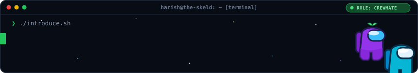
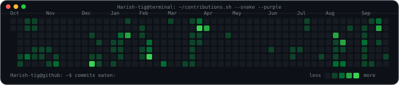

<div align="center">

<!--
  ┌─────────────────────────────────────────────────────────────────────────┐
  │  HEADER — Among Us Space Terminal                                        │
  │  Regenerate: python scripts/generate_typing_header.py                   │
  └─────────────────────────────────────────────────────────────────────────┘
-->


<br><br>

<!-- Navigation -->
<p>
  <code><a href="#info-sh"><strong>&nbsp;./info.sh&nbsp;</strong></a></code>&nbsp;·&nbsp;
  <code><a href="#profile-sh"><strong>&nbsp;./profile.sh&nbsp;</strong></a></code>&nbsp;·&nbsp;
  <code><a href="#contributions-sh"><strong>&nbsp;./contributions.sh&nbsp;</strong></a></code>&nbsp;·&nbsp;
  <code><a href="#stack-sh"><strong>&nbsp;./stack.sh&nbsp;</strong></a></code>&nbsp;·&nbsp;
  <code><a href="#social-sh"><strong>&nbsp;./social.sh&nbsp;</strong></a></code>
</p>

</div>

---

<!--
  ┌─────────────────────────────────────────────────────────────────────────┐
  │  INFO — two-column: GIFs left · JSON info card right                    │
  │  Info card: python scripts/generate_info_card.py                        │
  └─────────────────────────────────────────────────────────────────────────┘
-->
<h3 id="info-sh"><code>harish@github:~ $ ./info.sh</code></h3>

<table width="100%">
<tr>
<td width="42%" valign="top" align="center">


</td>
<td width="58%" valign="top">


</td>
</tr>
</table>

---

<!--
  ┌─────────────────────────────────────────────────────────────────────────┐
  │  PROFILE — whoami                                                        │
  └─────────────────────────────────────────────────────────────────────────┘
-->
<h3 id="profile-sh"><code>harish@github:~ $ ./profile.sh</code></h3>

```
$ whoami

  Software engineer specializing in backend systems and applied AI/ML.
  Pursued B.E. in Artificial Intelligence & Machine Learning at the
  University of Mumbai (Class of 2026).

  Internship Experience:
  • 10x Growth      -> Flutter Developer
  • OnlineSavaari   -> Backend Developer

  Core Stack: Python (FastAPI, Django), Express.js, PostgreSQL, MongoDB, Redis, Docker.
  Focused on resilient architectures, clean APIs, and scalable backend pipelines.

  Competed in national hackathons, placed 1st in algorithm development,
  reached the Smart India Hackathon finals in 2024.

  Outside the terminal: football.
```

---

<!--
  ┌─────────────────────────────────────────────────────────────────────────┐
  │  CONTRIBUTIONS — purple snake (refreshed daily by GitHub Actions)       │
  └─────────────────────────────────────────────────────────────────────────┘
-->
<h3 id="contributions-sh"><code>harish@github:~ $ ./contributions.sh</code></h3>

<div align="center">

</div>

---

<!--
  ┌─────────────────────────────────────────────────────────────────────────┐
  │  STACK — verified technologies                                           │
  └─────────────────────────────────────────────────────────────────────────┘
-->
<h3 id="stack-sh"><code>harish@github:~ $ ./stack.sh</code></h3>

```json
{
  "languages":    ["Python", "JavaScript", "SQL", "C"],
  "backend":      ["FastAPI", "Django", "Express.js", "Django REST Framework", "Flask", "JWT Auth"],
  "databases":    ["PostgreSQL", "MongoDB", "MySQL", "Redis"],
  "ai_ml":        ["TensorFlow", "Keras", "Scikit-Learn", "CNN", "LSTM", "Transfer Learning"],
  "data":         ["NumPy", "Pandas", "Matplotlib"],
  "cloud_devops": ["AWS (EC2, S3, Lambda, Elastic Beanstalk)", "Docker", "Linux", "Git"],
  "tools":        ["Postman", "Cloudinary", "Vercel", "Render"]
}
```

<div align="center">

[](https://www.python.org/)
[](https://fastapi.tiangolo.com/)
[](https://www.djangoproject.com/)
[](https://expressjs.com/)
[](https://www.postgresql.org/)
[](https://www.mongodb.com/)
[](https://redis.io/)
[](https://aws.amazon.com/)
[](https://www.docker.com/)
[](https://www.tensorflow.org/)
[](https://www.kernel.org/)

</div>

---

<!--
  ┌─────────────────────────────────────────────────────────────────────────┐
  │  SOCIAL — verified links                                                 │
  └─────────────────────────────────────────────────────────────────────────┘
-->
<h3 id="social-sh"><code>harish@github:~ $ ./social.sh</code></h3>

```
$ ./social.sh --ping

  GitHub     ->  github.com/Harish-tig
  LinkedIn   ->  linkedin.com/in/harish-nadar-tig
  Portfolio  ->  harishnadar.tech
  Instagram  ->  instagram.com/harish_05n
  LeetCode   ->  leetcode.com/u/harish_tig
  Email      ->  nadarharish03@gmail.com
```

<div align="center">

[GitHub](https://github.com/Harish-tig)&nbsp;·&nbsp;
[LinkedIn](https://www.linkedin.com/in/harish-nadar-tig/)&nbsp;·&nbsp;
[Portfolio](https://harishnadar.tech/)&nbsp;·&nbsp;
[Instagram](https://www.instagram.com/harish_05n/)&nbsp;·&nbsp;
[LeetCode](https://leetcode.com/u/harish_tig/)&nbsp;·&nbsp;
[nadarharish03@gmail.com](mailto:nadarharish03@gmail.com)

<br>

[](https://hits.sh/github.com/Harish-tig/)
&nbsp;
[](https://github.com/Harish-tig)

</div>

---

<!--
  ┌─────────────────────────────────────────────────────────────────────────┐
  │  FOOTER — the goat + sign-off                                           │
  └─────────────────────────────────────────────────────────────────────────┘
-->
<div align="center">


<br><br>

```
alright that's it — you've seen the whole thing.
took a look around, had a vibe, now you know.

see ya, bye!  👋
```

<br>

<sub><code>harish@github:~ $ exit</code></sub>

</div>
